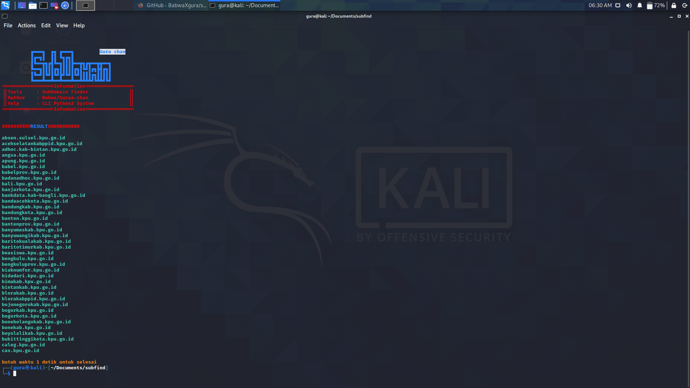

# subfind
SubDomain Finder Scanner With CLI 

<p align="center">
  <a name="top" href="#">
     
  </a>
</p>

# Installation
<details open>
<summary> pydroid / Linux</summary>

- ```bash
  $ apt update && apt upgrade
  ```

- ```bash
  $ apt install python git -y
  ```

- ```bash
  $ git clone https://github.com/BabwaXgura/subfind
  ```

- ```bash
  $ pip3 install requests
  ```

- ```bash
  $ cd subfind
  ```

# Usage


- ```bash
  $ python3 run.py -h/--help
  ```


- ```bash
  $ python3 run.py -v/--version
  ```


- ```bash
  $ python3 run.py -d/--domain [the domain]
  Example
  $ python3 run.py -d google.com
  ```


- ```bash
  $ python3 run.py -d/--domain [the domain] -s/--save [filename]
  Example
  $ python3 run.py -d google.com -s result
  ```
